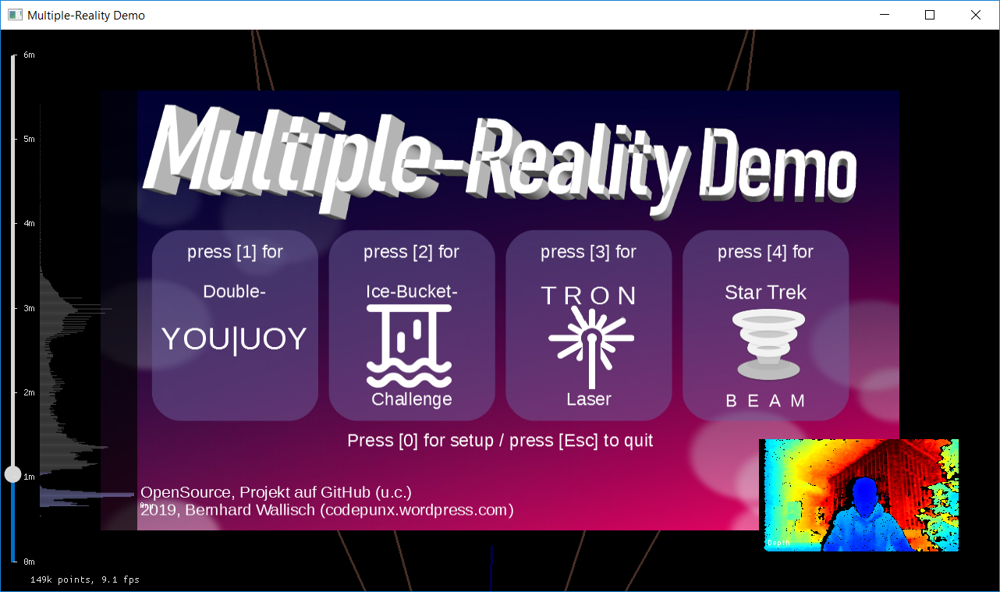

# MultipleReality
Projects demonstrating the possibilities of multiple-reality - merging virtual-reality and the real world

## Prerequisites:
* Intel RealSense D435i or D415i camera
* librealsense 2.0 SDK installed

## Getting started:
1. Clone the whole repository
2. Open the MultipleReality.sln in Visual Studio 2017
3. Set MRDemo as startup project
4. Run
